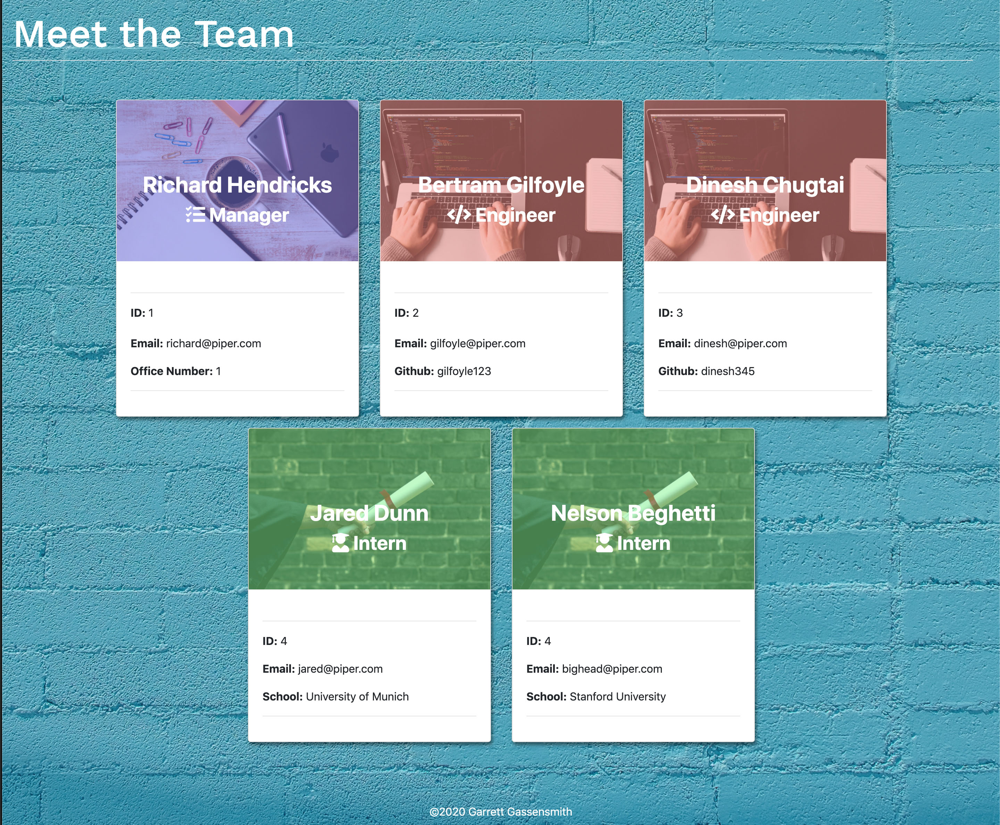

  # Team Profile Generator


  ## Description
  Team Profile Generator is a simple CLI that takes in employee data and returns an HTML page with organized information on each member of the team! It allows managers to organize and display team data in one place quickly, easily and aesthetically.

  
  ## Table of Contents
  * [Installation](#installation)
  * [Usage](#usage)
  * [Contributing](#contributing)
  * [Tests](#tests)
  * [Credits](#credits)
  * [License](#license)
  * [Questions](#questions)
  
  
  ## Installation
  Download the files, navigate to the "Develop" folder in your preferred shell and run the following code: 
  ```sh
  npm install
  ```
  
  ## Usage
  Navigate to the "Develop" folder in your preferred command line interface and run one of the following lines of code:
  ```sh 
  node app.js 
  ``` 
  ```sh 
  npm start
  ``` 
  From there follow the prompts and the app will generate an HTML file automatically using the information you provided.

   
 
  
  
  ## Contributing
  There are currently no guidelines for contributing, fork and edit to your hearts content.
  
  
  ## Tests
  Navigate to the "Develop" folder in your preferred command line interface and run the following code: 
  ```sh 
  npm run test
  ```
  

  ## Credits
  * [gmg300](https://github.com/gmg300)
  

        
  
  
  ## License
  [](https://opensource.org/licenses/MIT)

  Copyright &copy;2020 Garrett Gassensmith 
  
  
  ## Questions
  
  
  For questions or feedback email me at garrettgassensmith@gmail.com  
